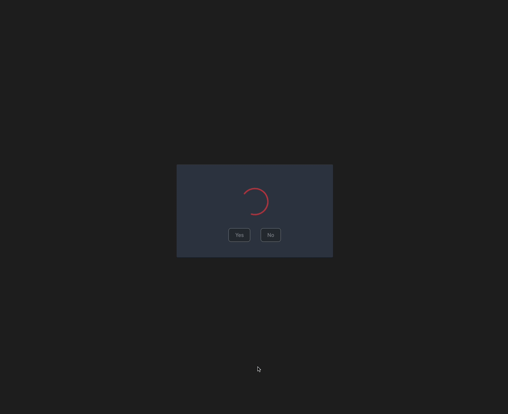

Readme

Hello! Welcome to a quick game I threw together to play with OpenAI, dip my toes into Ruby/Rails, and brush back up on React with TypeScript.

In the game, the user is presented with a randomized, AI-generated fictional scenario in which they encounter a closed box. The user is then given the choice of whether to open the box or not, and gets a generated ending based on their choice.

It looks like this:

## Installation
You will need to provide your own OpenAI API key and OpenAI organization ID for the client calls.

Install your dependencies, `npm run dev` and `rails s`.

## Tech
This project was made using [Vite Ruby](https://vite-ruby.netlify.app/), React and the OpenAI API. For now, it uses PrimeReact as a UI library, but I will probably add Tailwind so I can play with some shadcn-derived libraries that look fun.